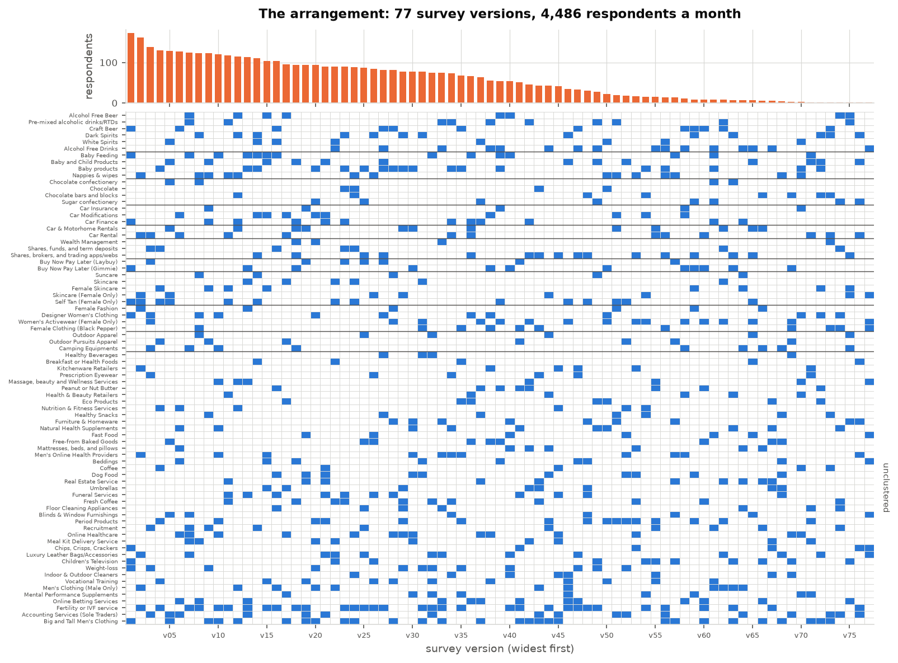
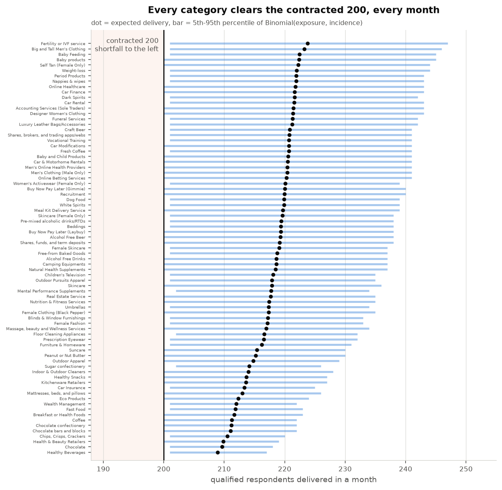
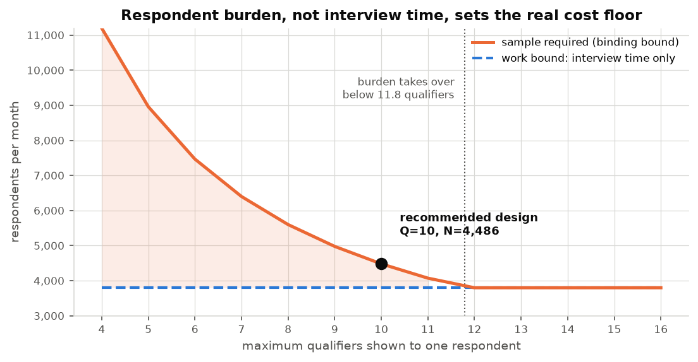

# Survey allocation

**Tracksuit | Data Scientist (Survey) technical take-home**

Every month, 77 categories each need 200 qualified respondents, no respondent may average more
than 8 minutes of interview, and the sample exposed to each qualifier must look like the country.
This is the schedule I would field, what it costs, and what I looked at on the way.

The analysis is in [`solution.ipynb`](./solution.ipynb); section numbers below point into it.

> **The service level this is built to.** The contract as described in the brief is *"at least
> 2,400 per year"*, with 200 a month as its *"roughly"* monthly translation. This design commits to
> the harder promise - **every category clears 200 in at least 95% of months**, not merely in
> aggregate over the year - because a customer sees a monthly number and a light month is a
> conversation with them whatever the annual total says. That is a deliberate purchase: **+6.7%**
> against the pooled alternative, **+9.5%** against simply sizing to the mean. Both alternatives are
> priced in "The commercial case" and "What else we explored".

---

## The plan

A **version** is a set of qualifying questions shown to one respondent, who then completes the
survey for every category they qualify for. Qualifiers cost no interview time, so one respondent
can be screened for many categories at once - that is the whole saving. A solver decides which
categories share a version and how many respondents each version gets.

**Field 77 versions a month, at a total of 4,486 respondents.** That is 0.15% above a floor no
design can beat at this service level.

| | |
|---|---|
| Respondents per month | **4,486** |
| Proven lower bound | 4,479, so **+0.15%** |
| Survey versions | 77 |
| Qualifiers per respondent | 10 maximum |
| Mean interview | 407s of the 480s allowed |
| Interviews over 8 minutes | 33% |
| Every category clears 200/month | **95.5%** of months, worst category |
| Marginal cost of a new category | ~67 respondents/month |



Each column is a version, each row a category; the bar on top is how many respondents that version
needs. Categories are grouped by co-purchase cluster, and the design never puts more than two
members of a cluster on the same respondent.

### Eight of the seventy-seven

| Version | Respondents | Qualifiers | E[interview] | Categories screened for |
|---|---|---|---|---|
| **v01** | 172 | 10 | 290s | Big and Tall Men's Clothing · Self Tan (Female Only) · Baby Feeding · Car Finance · Designer Women's Clothing · Weight-loss · Craft Beer · Buy Now Pay Later (Gimmie) · Children's Television · Chips, Crisps, Crackers |
| **v03** | 138 | 10 | 409s | Designer Women's Clothing · Car Rental · Accounting Services (Sole Traders) · Weight-loss · Buy Now Pay Later (Laybuy) · Recruitment · Women's Activewear (Female Only) · Shares, funds, and term deposits · Camping Equipments · Prescription Eyewear |
| **v08** | 123 | 10 | 430s | Fertility or IVF service · Designer Women's Clothing · Nappies & wipes · Dark Spirits · Online Betting Services · Meal Kit Delivery Service · Female Clothing (Black Pepper) · Outdoor Apparel · Suncare · Chocolate confectionery |
| **v20** | 94 | 10 | 425s | Big and Tall Men's Clothing · Baby products · Designer Women's Clothing · Weight-loss · Period Products · Car Modifications · Men's Clothing (Male Only) · Meal Kit Delivery Service · Sugar confectionery · Wealth Management |
| **v40** | 54 | 10 | 403s | Fertility or IVF service · Baby Feeding · Weight-loss · Luxury Leather Bags/Accessories · Buy Now Pay Later (Gimmie) · Alcohol Free Beer · Indoor & Outdoor Cleaners · Furniture & Homeware · Mattresses, beds, and pillows · Fast Food |
| **v60** | 9 | 10 | 344s | Fertility or IVF service · Big and Tall Men's Clothing · Car Rental · Fresh Coffee · Craft Beer · Online Betting Services · Buy Now Pay Later (Gimmie) · Women's Activewear (Female Only) · Free-from Baked Goods · Peanut or Nut Butter |
| **v72** | 2 | 10 | 426s | Big and Tall Men's Clothing · Baby products · Designer Women's Clothing · Dark Spirits · Baby and Child Products · Luxury Leather Bags/Accessories · Female Skincare · Peanut or Nut Butter · Chocolate bars and blocks · Eco Products |
| **v77** | 1 | 10 | 421s | Luxury Leather Bags/Accessories · Alcohol Free Drinks · Women's Activewear (Female Only) · Beddings · Skincare (Female Only) · Female Clothing (Black Pepper) · Blinds & Window Furnishings · Massage, beauty and Wellness Services · Chips, Crisps, Crackers · Fast Food |

Three things to notice. **Every version carries exactly 10 qualifiers** - screening capacity is the
binding resource, so the optimiser never leaves a slot empty. **Every version lands between 140s
and 434s of expected interview**, comfortably inside 480s, because time stopped being the scarce
thing. And the hard-to-find categories appear on many versions: *Fertility or IVF service*
(9.6% incidence) is screened on 36 of the 77, while *Healthy Beverages* (88.5%) needs only 4.

One wart, stated rather than hidden: the schedule has a tail of tiny versions - 19 of the 77 are
fielded to fewer than 10 respondents, and the last to one. That is an artefact of rounding a linear
program, not a modelling insight. In practice, merge anything below ~10 respondents into its
nearest neighbour; the top 20 versions already carry 53% of the sample, and the merge costs a
handful of respondents against a lot of fielding complexity.

### And who those respondents are

Every version ships with its own recruitment quota - a fielding instruction a panel provider can
take directly. The largest version, as an example:

```
v01  -  172 respondents
  gender   Male 49% (nat 49%)   Female 51% (nat 51%)
  age      18-24 13% (13%)   25-34 18% (19%)   35-44 17% (17%)
           45-54 17% (17%)   55-64 16% (15%)   65+ 19% (19%)
  region   Auckland 35% (34%)   Wellington 10% (11%)   Rest of North Is. 25% (25%)
           Canterbury 13% (13%)   Rest of South Is. 16% (17%)
```

A version itself is demographically blind - it is only a set of 10 qualifier questions. The
requirement is met one layer down, in *who* receives each version: a 60-cell quota table per
version (2 genders x 6 age bands x 5 regions), built by a low-discrepancy allocation and then a
swap pass that moves respondents around 2x2 rectangles, preserving every version's headcount and
every cell's national share exactly while driving each category's marginals to target. It takes the
worst deviation from 9.6pp to 0.83pp and costs nothing, because it decides who gets a version
rather than what goes on one (§8).

The guarantee is **per category, not per version**, and that distinction has an operational
consequence:

| | Worst deviation from national |
|---|---|
| Per category exposed sample - the actual requirement | **0.83pp** |
| Per version, median across the 58 versions of 10+ people | 2.6pp |
| Per version, worst case (11 respondents) | 26.5pp |

Small versions are lumpy because you cannot spread 11 people over 60 cells. It does not matter,
because a category pools 236-2,340 respondents across many versions and the balancing pass targets
those pooled marginals directly - the lumpiness cancels by construction rather than by luck. But it
means **the month's plan has to be fielded whole**: dropping a version, truncating one, or
under-filling a cell breaks the category-level quota, since the small versions are exactly what
carries the correction. It also means the tiny-version merge suggested above is a re-run of the
balancing pass, not a delete of some CSV rows.

The full schedule is in [`survey_plan.csv`](./survey_plan.csv), the demographic split of every
version in [`survey_plan_cells.csv`](./survey_plan_cells.csv), per-category delivery in
[`category_delivery.csv`](./category_delivery.csv), and section 11 of the notebook prints all
three.

### Does it do what it has to?

| Constraint | Result | |
|---|---|---|
| **Every category clears 200, every month** | worst category **0.9549** | PASS |
| | every category's whole 5th-95th band clears 200 | |
| | mean delivered 217.9 a month | |
| At least 2,400 qualified per category per year | worst category **1.000**, delivering 2,614 | PASS |
| Mean interview under 480s | **407.0s** exact, 406.8 ± 1.8s simulated | PASS |
| Exposed sample nationally representative | worst gender/age/region deviation **0.83pp** | PASS |
| Qualifiers per respondent | max **10** | PASS |
| Categories from one co-purchase cluster | max **2** | PASS |



**The monthly guarantee is exact, not estimated.** Each category's exposure is fixed by the
schedule, so its delivery is exactly `Binomial(exposure, incidence)` - there is no sampling
uncertainty in the promise itself. Every category's 5th percentile lands on 200 or above.

The simulation is a separate check on the *fielding*: 4,486 respondents placed in a quota cell and
a version, shown that version's qualifiers, routed into the survey of every category they qualify
for, with within-cluster correlation on qualification and log-normal durations - one month,
repeated 600 times (§10). Pooled across all category-months it reproduces the exact figure
(0.9595 ± 0.0018 against 0.9600). Its *worst single category* reads 0.937, which is not a breach:
that is the minimum of 77 estimates each carrying a standard error of 0.009, so it sits low by
construction. The exact figure governs, and the notebook asserts on it.

Two honest notes. **The guarantee makes you over-deliver.** Sizing every month to clear 200 puts
the mean at 218, so a category receives about 2,614 a year against 2,400 contracted - roughly 9% of
headroom you are paying for. That is not waste; it is the variance you buy out twelve times instead
of once. It does mean the design sits above "roughly 200" in the other direction, which is worth a
conscious decision rather than a shrug. **And the 8-minute rule is written on the mean respondent**:
satisfying it exactly as worded still sends 46.7% of people past 8 minutes, which defeats both
stated reasons for having it. This design buys that down to 33% for free; going further costs real
money (§7).

---

## The commercial case

Everything above is in respondents. Cost per completed interview is Tracksuit's number, not mine,
so it stays a parameter - but every figure below scales linearly in it.

| | at $3/complete | at $5 | at $8 | at $12 |
|---|---|---|---|---|
| **Annual sample bill** (53,832 respondents) | $0.16M | $0.27M | $0.43M | $0.65M |
| **Saved by bundling** vs one survey per category | $1.31M | $2.18M | $3.49M | $5.24M |
| **Cost of the monthly guarantee** over sizing to the mean | $14k | $23k | $37k | $56k |

Three things follow.

**1. Bundling is the whole game, and it is already won.** Running each category as its own survey
would take 40,879 respondents a month against 4,486 - a 9.1x difference, worth $1.3M-$5.2M a year.
The remaining optimisation prize is 0.15%, so the question is no longer "can we pack better" but
"what should we spend the headroom on". *One caveat on that comparison: I do not know what
Tracksuit fields today, so 40,879 is an upper bound on the prize, not a description of current
practice. The defensible claim is the distance to the lower bound, not the distance to a strawman.*

**2. Growth stops being sample-constrained.** A new category costs **67 respondents a month inside
the bundle against 531 standalone** - about $4.0k a year to serve rather than $31.9k at $5 a
complete. Onboarding the 78th category is a rounding error on the sample bill, which changes what
sales can promise.

**3. Cost to serve varies 9.5x across the book, but price does not.** The cheapest category costs
25 respondents a month to serve, the dearest 234 - $1.5k against $14.0k a year at $5. Forty of the
77 sit on the incidence side of the crossover, where a category burns scarce screening slots while
consuming almost no interview time. On a flat price those forty are cross-subsidised by the other
37. That is a margin leak with a known size, and it is the single most actionable finding here.

The service-level decision is the one genuinely new cost in this design, and it is small: **$181 to
$725 per customer per year**. Across the whole book it is paid for by retaining roughly one
customer a year on a contract worth more than $23k.

## What drives the number, and why

**1. Screening burden binds, not interview time.** 44,791 qualifier exposures have to be placed. At
10 qualifiers a head that needs 4,479 people *however short the interviews are*. Interview time
alone would allow 3,798. Burden takes over below 11.8 qualifiers per respondent, so any realistic
screening limit puts us on that side of the line (§7.5).



**2. Total interview work is an invariant, so the floor is provable.** A category needs `E`
respondents exposed, and each costs `incidence × length` seconds of expected interview time.
Multiply and incidence cancels:

```
Σ Eᵢ(pᵢLᵢ) = Σ (T/pᵢ)(pᵢLᵢ) = T Σ Lᵢ
```

Bundling cannot create or destroy interview work, only pack it tighter. That turns "find a good
heuristic" into "prove you are at the floor", and three floors apply at once (§2, §7.5):

```
N ≥ max( Σ Eᵢcᵢ/480 ,  maxᵢ Eᵢ ,  ΣEᵢ/Q )
      interview time   hardest      screening
                       to find      burden
```

The recommendation sits 0.15% above that maximum. The claim is not "the best we found" - it is
"nothing beats this by more than a fraction of a percent". An independent greedy packing algorithm,
run on the uncapped problem as a cross-check, lands within 0.4% of the solver (§3.1).

**3. So the quality protections are free.** The bound is a *max*, not a sum. Once burden sets the
sample size there is slack left in the time budget, so shortening interviews and spreading related
categories apart cost nothing. Capping screening at 10 costs 17.9% (3,806 → 4,488); adding the
cluster cap *and* the tail control on top of it then costs **nothing at all** - the final design is
4,486, marginally *below* the qualifier-capped figure on LP rounding - and takes over-long
interviews from 46.7% to 33%. These constraints are complements, not additive costs (§7.5, §9.5).

**4. Which flips the pricing rule.** Category cost is `max( E·c/480 , E/Q )`, and the two terms
cross at `incidence × length = 480/Q = 48 seconds`. With unlimited screening, cost is nearly pure
survey length and incidence only binds below 5.7%. Cap screening at 10 and a hard-to-find category
burns scarce screening slots while consuming almost no interview time - so **40 of the 77
categories** sit on the incidence side and are almost certainly underpriced today. The most
expensive category to serve costs 3.5x the average, and a new category costs ~67 respondents a
month inside the bundle against ~531 standalone. A flat price cross-subsidises the expensive half
from the cheap half (§7.6).

One more thing falls out of this. Because a category's exposed sample is just a mixture of version
pools, balancing the *versions* across quota cells balances all 77 categories at once -
representativeness decouples from the packing entirely and costs nothing (§8).

---

## The assumptions, and why they were made

Two of these are load-bearing enough to argue rather than list.

### Why log-normal for interview durations

`category_length_seconds` is a mean. To say anything about the 8-minute rule beyond the mean you
need a shape, and a shape is a choice. Four reasons for this one, in descending order of how much
they should convince you:

1. **The generative process is multiplicative.** Reading speed, comprehension, category familiarity
   and distraction do not *add* seconds to an interview, they *scale* it - a slow reader is slow on
   every question. A product of many small independent factors is log-normal for the same reason a
   sum of them is normal.
2. **The support is right.** Duration is strictly positive, has a hard floor and no ceiling. A
   normal distribution puts mass below zero, which at these coefficients of variation is not a
   rounding error.
3. **It is the standard model for this quantity.** Item-level response times in psychometrics are
   conventionally log-normal - van der Linden's hierarchical response-time model is the reference -
   and web-survey completion times are routinely reported the same way.
4. **It is the conservative choice.** Skew pulls the median down while the mean is pinned, so the
   tail stretches. Assuming log-normal makes us report a *worse* over-run rate than a symmetric
   assumption would; if the truth is less skewed, the design is better than advertised.

**What it does not affect: the cost.** `E[T] = Σ pᵢLᵢ` holds whatever the duration distribution is,
so the sample size, the lower bound, the optimiser and delivery are all untouched (§6, §9.5). The
assumption buys exactly one thing - the shape of the tail, which is where the 480-second policy
question lives. A lighter-tailed choice (gamma, Weibull with shape > 1) would lower the reported
33%; a heavier one would raise it. So what this assumption governs is *how much tail control to
buy*, not what to pay for sample. The spread parameter `θ` is carried as a sensitivity parameter
rather than an estimate, because we do not have Tracksuit's paradata; calibrating it from their own
timing logs is one line of code.

### Why the monthly SLA was worth buying

The contract as described in the brief is annual - *"at least 2,400 per year"* - with 200 a month
as its *"roughly"* translation. Committing to the monthly number is therefore a decision, not a
requirement, and it should survive being questioned:

- **The failure mode is visible monthly.** A customer sees a monthly number on a tracker. The
  annual total is an accounting fact they never look at. Under the pooled policy the worst category
  lands under 200 in a third of its months, and the lowest month seen was 163.
- **The measurement damage is real but modest.** At n=200 the 95% interval on a brand metric at 50%
  is ±6.9pp; at 170 it widens to ±7.5pp, and month-on-month change detection goes from ±9.8pp to
  ±10.2pp. That is about 8% more noise in the trend line the customer is paying for - not a broken
  product, but the wrong direction on the one thing the product does.
- **It is cheap insurance.** $181-$725 per customer per year, against a churn conversation. This is
  the argument that actually carries the decision; the precision argument alone would not justify
  it.

**The counter-case, stated plainly.** It is above contract spec, and it makes you over-deliver:
sizing every month to clear 200 puts the mean at 218, so a category receives ~2,614 a year against
2,400 contracted - roughly 9% of headroom you are paying for. If Tracksuit's customers genuinely
read the annual number, the pooled row of the service-level table is 6.7% cheaper and the change is
one parameter.

### The rest

| Assumption | Why it is defensible | Does it change the answer? |
|---|---|---|
| Qualifiers cost 0 seconds | The brief grants it, and it is the whole source of the saving | **Yes if wrong** - so the design does not lean on it. Burden is capped at 10 as a first-class constraint (§7.5) |
| Incidence is uniform across demographic cells | Nothing in the data supports a cell-level model, and inventing one would be worse | **Unknown - the main open gap.** Five gender-restricted categories are already flagged (§8.1) |
| Within-cluster co-qualification `ρ` | Guessed, deliberately conservative; the true matrix is observable in Tracksuit's own response data | No - the cluster cap neutralises it (§9.5) |
| Demographic frame is synthetic | Placeholder for census joint counts; the mechanism does not depend on the numbers | No - swap the frame, nothing else changes |
| Months are independent | Simplification; panel reuse and fatigue are not modelled | Probably yes at scale - needs panel data to size |
| Incidence estimates are exact | They are not, so the planner carries a Beta posterior and plans against its 10th percentile | Handled (§4) |

## What else we explored

### Options priced, not taken

Four parameters are business calls rather than model outputs. The model prices any of them; these
are the menus. All figures are the binding floor at 10 qualifiers per respondent, which is the
constraint that actually sets cost (§7.5).

**Service level.** The decision that moved this design, and the expensive one.

| Policy | Respondents/month | vs pooled | Worst category's P(month ≥ 200) |
|---|---|---|---|
| No buffer | 4,092 | −2.6% | 0.512 |
| Annual pooled 95% - the contract as written | 4,200 | — | 0.694 |
| **Monthly 95% (recommended)** | **4,479** | **+6.7%** | **0.955** |
| Monthly 99% | 4,650 | +10.7% | 0.990 |

The pooled row is genuinely cheaper and genuinely satisfies "at least 2,400 per year". It leaves
the worst category short of 200 in a third of its months, which is why this design does not use it.
The service level is a dial rather than a switch: it is set by a single parameter `z`, so any point
between these rows is a re-run rather than a redesign, and the model prices whichever one Tracksuit
wants to commit to.

**Screening burden.** The only constraint here a customer never sees.

| Max qualifiers per respondent | Respondents/month |
|---|---|
| 12 | 4,265 |
| **10 (recommended)** | **4,486** |
| 8 | 5,606 |

Relaxing to 12 saves 5%, not the 18% a naive comparison suggests - tail control is only free while
burden binds, and at Q = 12 it stops binding. Below 8 it climbs steeply (Q = 6 costs ~7,500).

**Interview length.** How many respondents may run past 8 minutes?

| Over 8 minutes | Respondents/month |
|---|---|
| 46.7% (the rule as literally worded) | 3,806 |
| **33% (recommended)** | **4,486** |
| 20.8% | 5,337 |
| 15.5% | 5,976 |

The 46.7% row is an idealised design that is not fieldable: it puts up to 15 screening questions on
one person. With screening capped at 10 the floor is 4,479, so 33% is the cheapest tail actually
available - it comes free with the burden cap.

If nobody decides: Q = 10, tail control z = 0.25, monthly 95% service. That is what 4,486 assumes.

### Three things I expected that turned out to be wrong

- **Bundling "by certainty" would tighten the tail cheaply.** High-incidence categories are nearly
  deterministic, so packing them together ought to help. It does almost nothing: the section 2
  invariant applies to variance too, so bundling can only redistribute variance between
  respondents, never reduce it. The only way to pull the tail in is to spread the same work over
  more people (§7.1).
- **Cost would be back-loaded.** With no pooling left in month 12, I expected a scramble, and built
  a "risk ramp" to stop the policy coasting. Under pooling the opposite is true - month 12 is the
  *cheapest* month (3,139 against 3,708 in month 1), because the loop accumulates surplus and
  spends it down. The monthly guarantee then removes the dynamic entirely: the floor stops the loop
  coasting, so cost is flat (3,938 → 3,862). The finding stands against the pooled policy; it is no
  longer load-bearing for the one that ships (§9.1).
- **Thematic "families" were a sound way to group categories.** An earlier draft grouped the two
  Buy-Now-Pay-Later brands with share trading and wealth management - unsecured credit is not
  investing. Rebuilt into three tiers that each do one job, coverage honestly dropped from 51 of 77
  categories to 36 (§5). The design then turned out not to be sensitive to that taxonomy at all
  (§9.5), which is the most useful thing you can say about a judgement-based input.
